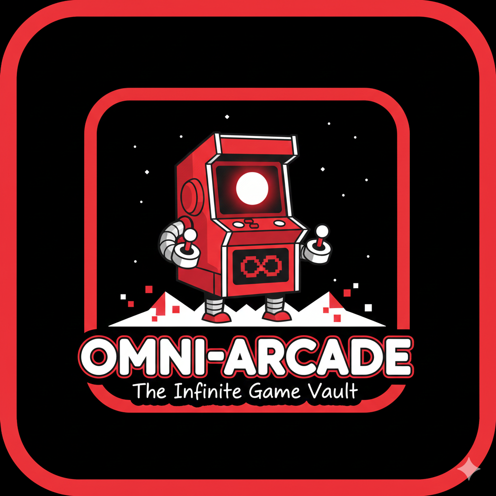

# 🕹️ Omni-Arcade: The Infinite Game Vault

Omni-Arcade is a high-performance, all-in-one gaming ecosystem. By consolidating classic board games like Chess and Ludo with modern hyper-casual titles, it eliminates "app fatigue" and provides a unified social layer for gamers worldwide.

## 🚀 Key Features

**🔀 Seamless Switching:** Transition between a strategic game of Chess and a casual round of Ludo in seconds without reloading the core engine.

**🌍 Global Matchmaking:** A custom Elo-based matchmaking system ensures you face opponents at your skill level.

**🤖 Adaptive AI (Neural-Core):** Our offline bots don't just follow scripts; they adapt to your playstyle, offering a genuine challenge from "Novice" to "Grandmaster."

**🔋 Battery Efficient:** Optimized rendering loops ensure you can play longer without draining your device or overheating.

**💬 Social Meta-Layer:** Integrated voice snippets, customizable emojis, and persistent friend rooms.

